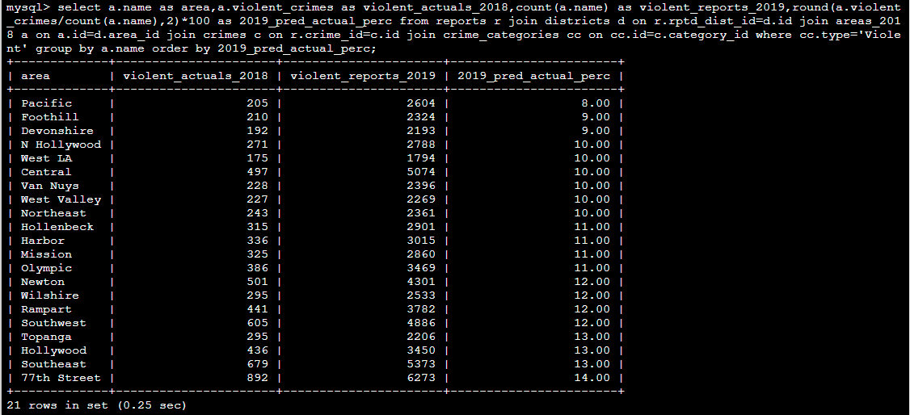
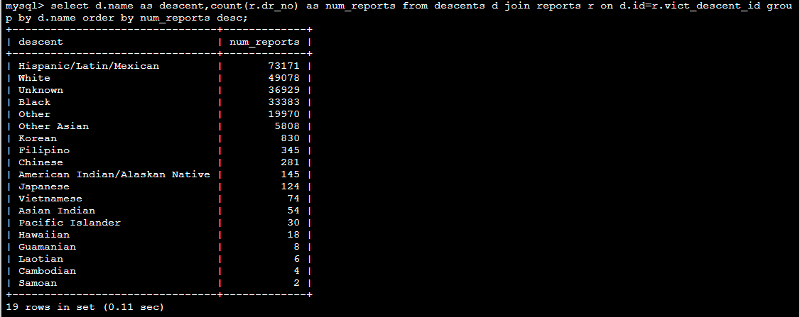
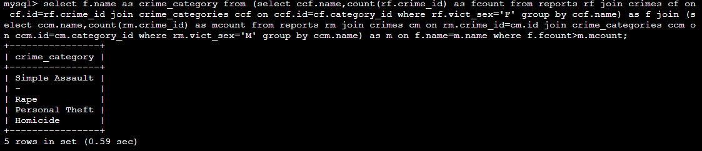

# 2020_LACrimes_DB
SQL Database and queries

This is a database created using python and MySQL for a subset of Los Angeles Crime Data from 2019-2020.

## DATA SOURCES

- Crime reports: [LA City](https://data.lacity.org/A-Safe-City/Crime-Data-from-2010-to-2019/63jg-8b9z)
- Demographics: [Think Health LA](https://www.thinkhealthla.org/demographicdata?id=256&sectionId=941#sectionPiece_197)
- Area crime statistics: [LAPD online](http://www.lapdonline.org/crime_mapping_and_compstat)

## PROCESS

- **Data cleaning/subsetting:** Python
- **Foreign Key Creation:** Python
- **Data Import:** MySQL/Data Grip

## SAMPLE QUERIES

Below is a set of questions that can be answered from the data and the SQL queries used to answer them.

### Where Crimes are Being Reported

1.  Which cross street has had the most reported crime incidences? And what percentage of total reported crimes did it have?

    `mysql> select cross_st,count(cross_st) as num_reports,count(cross_st)*100/(select count(1) from reports) as percent from reports group by cross_st order by num_reports desc limit 1;`
    
    
2.	What are the top 5 areas with the most crimes in 2019?

    `mysql> select a.name as area,count(a.name) as num_reports from reports r join districts d on r.rptd_dist_id=d.id join areas_2018 a on a.id=d.area_id group by a.name order by num_reports desc limit 5;`
    
    
3.	What 5 premise types have the most crimes?

    `mysql> select p.name as premise,count(p.name) as num_reports from premises p join reports r on r.premise_id=p.id group by p.name order by num_reports desc limit 5;`
    
    
4.	The *areas_2018* table has total counts of confirmed violent and property crimes by area in 2018. Using the *areas_2018* table as an estimate, what percent of violent crimes reported in 2019 might be actual occurrences of crime?

    `mysql> select a.name as area,a.violent_crimes as violent_actuals_2018,count(a.name) as violent_reports_2019,round(a.violent_crimes/count(a.name),2)*100 as 2019_pred_actual_perc from reports r join districts d on r.rptd_dist_id=d.id join areas_2018 a on a.id=d.area_id join crimes c on r.crime_id=c.id join crime_categories cc on cc.id=c.category_id where cc.type='Violent' group by a.name order by 2019_pred_actual_perc;`
    

### Demographic Questions

5.	How many crimes have been reported by each descent?

    `mysql> select d.name as descent,count(r.dr_no) as num_reports from descents d join reports r on d.id=r.vict_descent_id group by d.name order by num_reports desc;`
    
    
6.	What crime categories have more female victims than male victims?

    `mysql> select f.name as crime_category from (select ccf.name,count(rf.crime_id) as fcount from reports rf join crimes cf on cf.id=rf.crime_id join crime_categories ccf on ccf.id=cf.category_id where rf.vict_sex='F' group by ccf.name) as f join (select ccm.name,count(rm.crime_id) as mcount from reports rm join crimes cm on rm.crime_id=cm.id join crime_categories ccm on ccm.id=cm.category_id where rm.vict_sex='M' group by ccm.name) as m on f.name=m.name where f.fcount>m.mcount;`
    
    
7.	Looking at the arrest status for the crime reports, what crimes have been committed by juveniles?

    `mysql> select distinct(c.name) as crime_name from crimes c join reports r on r.crime_id=c.id where (r.arrest_status="Juv Arrest" or r.arrest_status="Juv Other") order by crime_name;`
    

### Additional Questions

8.	What is the average number of days between when a crime occurs and when it is reported?

    `mysql> select avg(r.days) as avg_days_to_rpt from (select date_rptd-date_occ as days from reports) as r;`
    
    
9.	Give a breakdown of the number of reported crimes for each arrest status.

    `mysql> select arrest_status,count(arrest_status) as num_reports from reports group by arrest_status order by num_reports desc;`
    
    
10.	We want to know the monthly trend of when robberies occur. For each month, what is the number of crimes that occurred in the ‘Robbery’ category?

    `mysql> select month(r.date_occ) as month,count(r.date_occ) as num_robberies from reports r join crimes c on c.id=r.crime_id join crime_categories cc on cc.id=c.category_id where cc.name="Robbery" group by month order by month;`
    

## ENTITY RELATIONSHIP DIARGRAM (ERD)

